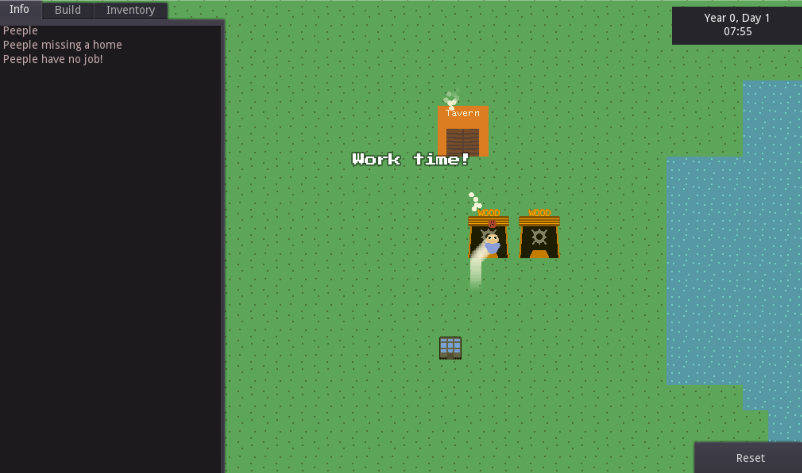

# IdleCity

> **open source idle city builder game**

Idle city is a game where you build a town with NPCs that work jobs and get you resources.

# About
This game is an idle city builder game. I plan it to be a mix between sim city and an idle game
The idea is you have `Peeple` and you can make them work, making them work produces resources, so on and so forth.

# Extra Remarks
Feel free to contribute
Make sure to mention what your PR does and try to follow a similar coding standard!
If you are looking for things to do, look at issues on github. Or write ideas of what we should work on next in the Ideas.md!