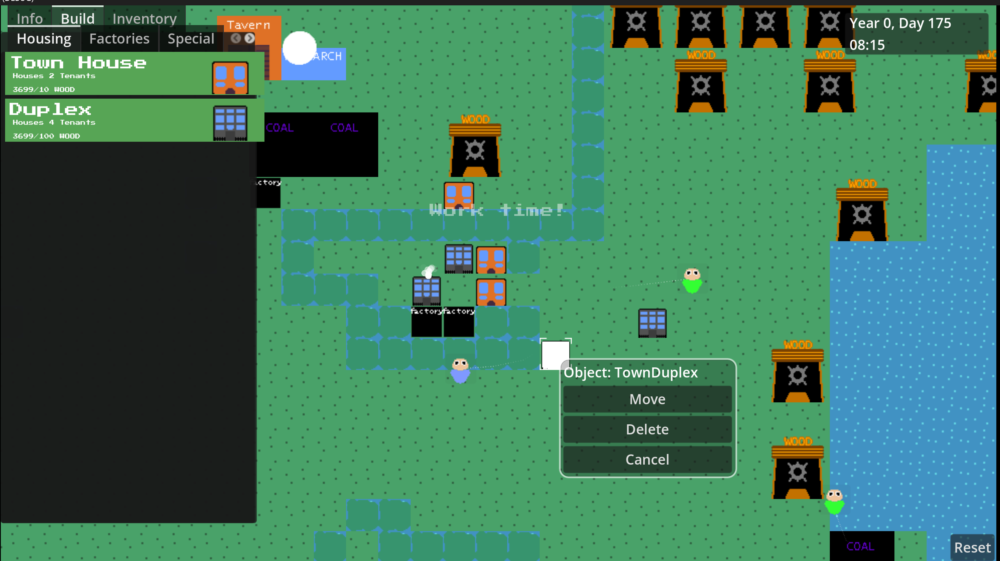

# IdleCity

# How to play

## Controls
- (F1) - to enter play mode
- (F2) - to enter build mode
- (F3) - to see what resources you own
- WASD - to pan camera
- Scroll mouse wheel - Zoom in / out

### Build Mode Controls
- Right click houses / factories to move / delete them
- Click housing buttons to select, then select a valid place to place the house!

### Play Mode  Controls
- Right click `Peeple` to check their stats or follow

## Gameplay
*Game is in early development!*

IdleCity is an open source game that is planned to be a mix between Sim City and an Idle Game. Build your city how you want it! However if you build it more efficiently, you can grow more quickly!

> Place down a buildings for `Peeple`!
- Place down factories to get them to work
- Place down houses for them to rest

> What Houses do
- Houses will regain happiness

> What Factories do
- Exchange `Peeple`'s happiness for product

# Extra Remarks
- Contributors are welcomed! The point of this project is to have it free and learn while making it!
- [Join the development discord!](https://discord.gg/mXv3FTXktz)
- When contributing, we want to have original content made (code, audio, art)
- Make sure to mention what your PR does and try to follow a similar coding standard!
- If you are looking for things to do, look at issues on github. Or look at the discussions page!
- [Check out our contributors!](CONTRIBUTING.md)

# Setting up
- This is currently running on Godot 4.2
- After you open up the Godot Editor. 
1. Go to Editor Settings and tick on `Trim Trailing Whitespace on Save`