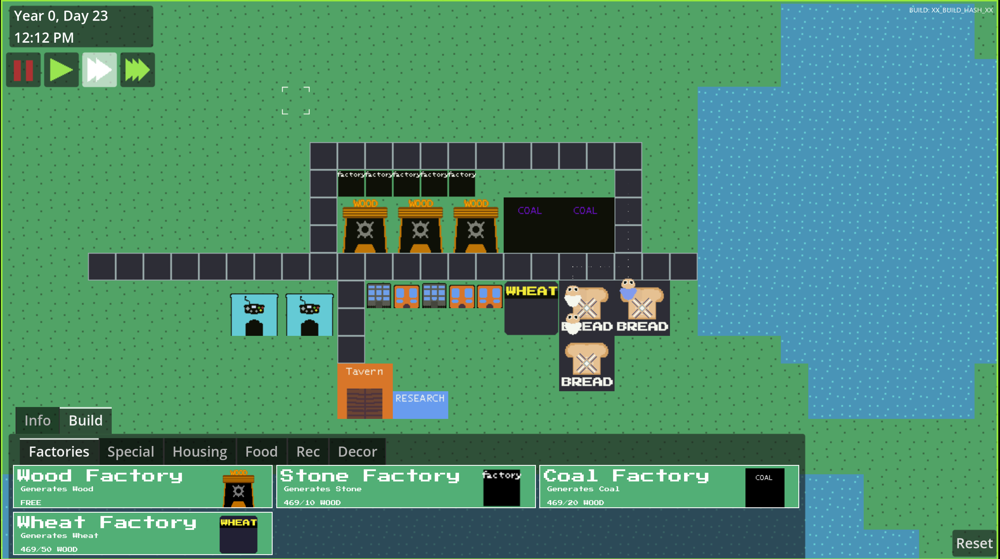

# IdleCity

# About
- This game is an open source idle city builder game. I plan it to be a mix between sim city and an idle game
- The idea is you have `Peeple` and you can make them work, making them work produces resources, resources can be towards upgrades and new buildings. So on and so forth.

# Extra Remarks
- Feel free to contribute. The point of this project is to have it free and learn while making it!
- [Join the development discord!](https://discord.gg/mXv3FTXktz)
- When contributing, we want to have original content made (code, audio, art)
- Make sure to mention what your PR does and try to follow a similar coding standard!
- If you are looking for things to do, look at issues on github. Or look at the discussions page!